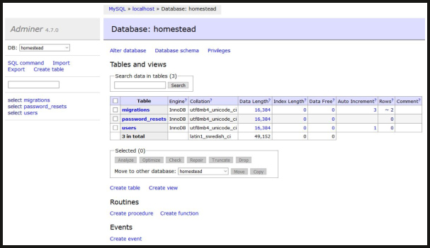
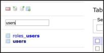
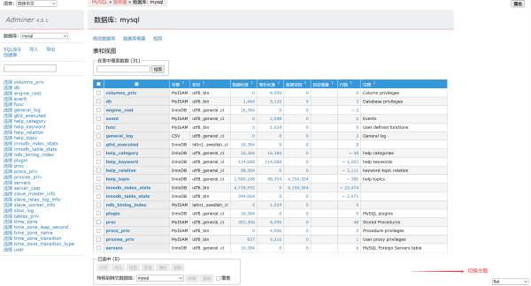

# laravel-adminer

<p align="center">
<a href="https://packagist.org/packages/hnllyrp/laravel-adminer"></a>
<a href="https://packagist.org/packages/hnllyrp/laravel-adminer"></a>
<a href="https://packagist.org/packages/hnllyrp/laravel-adminer"></a>
</p>

# Introduction
Laravel wrapper for [Adminer](https://www.adminer.org).
Adminer is a fast single-file database manager/explorer tool written by Jakub Vrana. It's a great replacement for
PhpMyAdmin (also supports PostgreSQL, SQLite, MS SQL, Oracle, Firebird, SimpleDB, Elasticsearch and MongoDB)


#### Database view with default theme




## Plugins Included

#### Tables-filter

Adds ability to do (fuzzy) search on table names. It's especially useful when you have a large set of tables




#### designs 切换主题




Installation 安装
```
composer require hnllyrp/laravel-adminer --dev
```


Publish config and theme file 发布配置与主题
```
php artisan vendor:publish --provider="Hnllyrp\Adminer\AdminerServiceProvider"
```

这个包是使用 官方源码包 编译打包而来，目前最新版本 4.8.1
- 支持设置自动登录
- 支持设置子域名访问
- 支持多语言切换
- 支持几个主题切换
- 支持自定义中间件, 但是发现基本没必要,作者的包都是自行处理的.默认即可,不过倒是可以用来加强安全验证


发布后,默认是开启的,记得正式环境下,不要暴露地址,用完修改路由前缀或者关闭


Remarks
由于Laravel 5和Adminer的函数名冲突，adminner.php文件函数cookie()、redirect()和view()的前缀都是adm前缀。


感谢：
https://github.com/vrana/adminer
